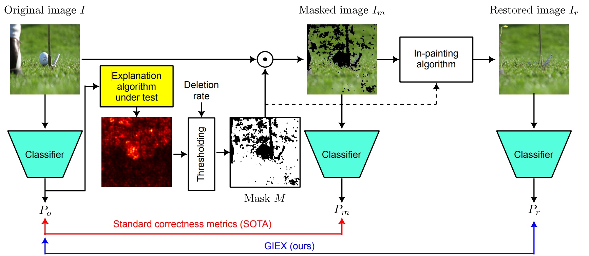

# GIEX — Generative Inpainting for the Evaluation of eXplanations

Official code for the ICPR 2026 paper
**"GIEX: Generative Inpainting for the Evaluation of eXplanations"**
by Mohamed Jalal Baim, Romain Xu-Darme, and Alban Grastien (CEA).

## Abstract

We present a novel method based on generative AI for evaluating the correctness of eXplainable AI (XAI) algorithms in the context of computer vision.
Unlike current state-of-the-art methods that deactivate pixels by setting them to a fixed value (e.g. black) to confirm their contribution to the decision,
our approach generates synthetic samples that are closer to both the original image and the original distribution of images. Using the Imagenet dataset, we empirically demonstrate how this approach leads to new empirical results when comparing the correctness of several XAI algorithms.

## Pipeline



1. **Attribute** — a XAI method produces a per-pixel importance map for the input image.
2. **Mask top-K** — the K most important pixels (fraction set in the config, default 30 %)
   are selected for removal.
3. **Inpaint** — the masked region is filled by RePaint (diffusion-based) or DeepFill v2 (GAN-based).
4. **Reclassify** — the inpainted image is passed through the same classifier.
5. **Compare confidence** — the drop (or rise) in predicted probability for the original class
   is the deletion (AURC) or insertion (AUIC) score.

The same pipeline is repeated at multiple deletion percentages (5 %–90 % in steps of 5 %)
to trace a full retention curve.

.png>)

## Installation

```bash
git clone <this-repo>
cd GIEX----Generative-Inpainting-for-the-Evaluation-of-eXplanations
pip install -r requirements.txt
```

External packages must be installed separately:

```bash
pip install -r requirements.txt
```

See **[`docs/weights_and_data.md`](docs/weights_and_data.md)** for the complete list of
pretrained weights, dataset setup, and exact download instructions.

## Reproducing the paper results

All experiment scripts read their configuration from a YAML file passed via `--conf_path`.
Config files are in `confs/` and follow the naming convention `conf_{method}_{seed_index}.yml`
where `seed_index` ∈ {0, 1, 2} corresponds to three random seeds (set in the YAML).

Methods: `saliency`, `integrated gradients`, `grad-cam`, `grads`, `smoothgrad`, `gbp`, `lrp`.

## Citation

Waiting for publication

See also [`docs/CITATION.cff`](docs/CITATION.cff).
